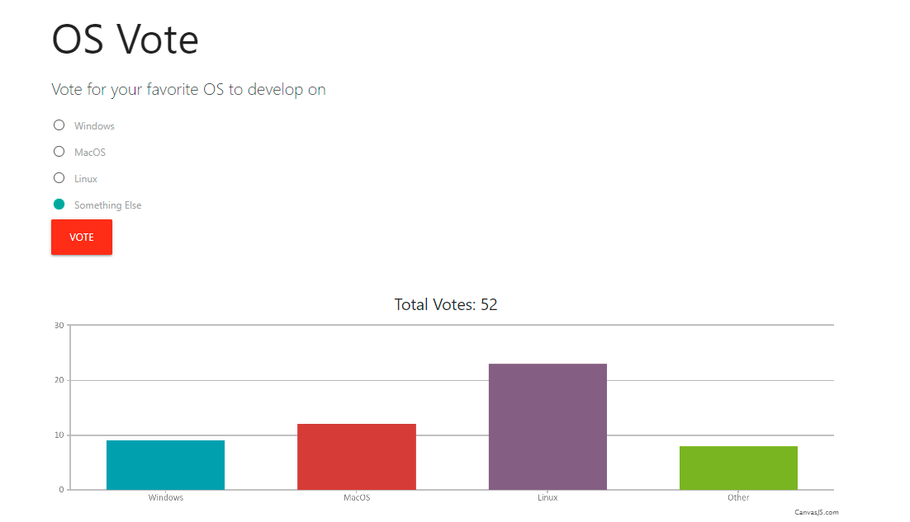

# PusherPoll

> Real-Time polling application using Pusher, Node.js, Express, MongoDB and CanvasJS

## Quick Start

Create .env File in Root Folder and Add all the Environment Variables in that

```bash
# Install dependencies
npm install

# Run dev server localhost:3000
npm run dev

# Start
npm start
```

